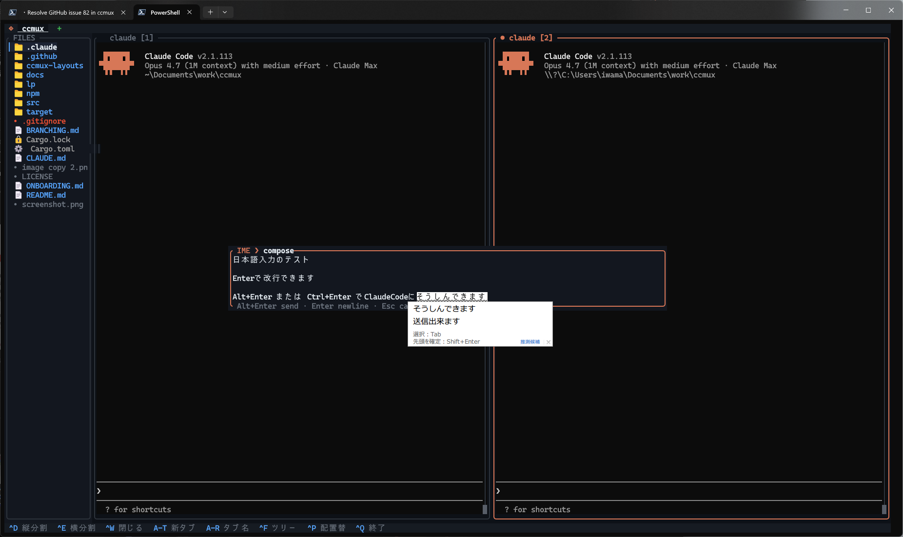

# renga

*Read this in other languages: [日本語](./README.ja.md)*

**An AI-native terminal substrate for orchestrating multiple [Claude Code](https://docs.anthropic.com/en/docs/claude-code) and Codex agents in one TUI — mixed-client peer messaging, Claude-specific UX where it matters, single binary.**


## What renga is

renga is a terminal where the panes know they are AI agents. Splits, tabs, and focus work like any TUI multiplexer, but the substrate underneath treats each pane as a first-class agent endpoint: it detects which panes are running Claude Code, lets Codex panes participate in the same peer network, exposes pane-control tools (`spawn_claude_pane`, `spawn_codex_pane`, `set_pane_identity`, `new_tab`, …), and keeps peer scope authoritative at the renga-tab level. Claude peers receive interrupt-style channel pushes; Codex peers get pane-local nudges from renga and read the actual message body with `check_messages`. Each pane also carries an optional `role` label (used for filtering and display), but message routing itself is by id or name.

The target use case is **agent orchestration** — a "secretary" pane dispatching tasks to "worker" panes, sub-agents comparing approaches in parallel, a long-running session reaching out to a sibling for a quick lookup, or a mixed Claude/Codex tab where each client is used for what it is best at. If you only ever run one agent at a time, renga's value over your current terminal is small. If you run several, the peer channel and the AI-aware pane model are the point.

### Positioning vs. tmux / zellij

| | tmux / zellij | renga |
|---|---|---|
| Pane model | Generic shell sessions | First-class **AI agent endpoints** with stable id, role, focus flag |
| Inter-pane messaging | Copy-paste, manual `send-keys`, or external glue | Built-in MCP `renga-peers` network; Claude receives channel pushes, Codex gets a pane-local nudge and reads the queued body via `check_messages` |
| Spawning agent panes | User hand-wires shell commands and client flags | `spawn_claude_pane` / `spawn_codex_pane` MCP tools, plus `Alt+P` for Claude |
| IME / CJK | Host terminal handles it; candidate windows often jump as Claude streams | Built-in IME composition overlay with freeze-on-overlay + periodic catch-up so candidates anchor to the caret |
| Configuration surface | Shell glue, plugins, keytables | A small TUI binary; layout TOMLs declare panes/roles directly |

**Non-goals.** renga is *not* a generic tmux replacement — it does not aim to match tmux's session persistence, nested-server model, plugin ecosystem, or scripted automation surface. It does not try to be a terminal emulator (no font/glyph rendering of its own; it runs inside your existing terminal). It is not an IDE plugin or chat UI. The bet is narrower: be the best substrate for **multiple Claude Code agents collaborating in one window**, and stay small enough to ship as a single ~10 MB binary.

### Example: secretary + workers orchestration

A typical layout used by [`claude-org`](https://github.com/suisya-systems/claude-org) / [`claude-org-ja`](https://github.com/suisya-systems/claude-org-ja) — one "secretary" pane dispatches tasks to one or more "worker" panes via the renga-peers channel:

```
tab "project-X"
┌────────────────────┬────────────────────┐
│ secretary          │ worker-1           │
│ (claude, role=     │ (claude, role=     │
│  "secretary")      │  "worker")         │
│                    │                    │
│  send_message ────▶│  receives as       │
│   to_id="worker-1" │  <channel ...>     │
│                    │                    │
│◀── reply ──────────│                    │
└────────────────────┴────────────────────┘
```

From the secretary's chat, growing the team and dispatching a task is two MCP calls — no shell, no copy-paste:

```
> call spawn_claude_pane with direction="right", role="worker", name="worker-1"
# new pane appears, Claude boots with the peer channel auto-wired

> call send_message with to_id="worker-1" and
  message="please grep src/ for TODO(perf) and report file:line + 1 line of context"
```

worker-1 sees a `<channel source="renga-peers" from_id="…" from_name="secretary">…</channel>` tag in its next turn, recognises it as a peer request (not user input — the tag's `source` attribute makes that distinction), does the work, and replies back via `send_message(to_id="secretary", …)`. Stable name lookups mean the secretary addresses peers as `"secretary"` / `"worker-1"` instead of chasing numeric ids; `set_pane_identity` lets it (re)assign a pane's name mid-session if needed.

When a worker lands on an interactive prompt, the orchestrator can stay in-band: `inspect_pane(target="worker-1", lines=20)` to confirm the visible state, then `send_keys(target="worker-1", text="y", enter=true)` or named keys like `Esc`, arrows, and `Ctrl+C` to answer it. For elastic teams, `poll_events` gives you a cursor you can keep between turns so you notice `pane_started` / `pane_exited` without rescanning the full tab every time.

The same primitives scale to richer layouts: a dispatcher with several workers in one tab, evaluator panes watching a worker's output, or sibling tabs each holding an isolated team (peer messaging is scoped per tab — `new_tab` widens layout, it doesn't bridge channels). See [Peer messaging between Claude Code panes](#peer-messaging-between-claude-code-panes) for the full tool surface.

## Features

- **Multi-pane terminal** — Split vertically/horizontally, run independent PTY shells
- **Tab workspaces** — Multiple project tabs with click-to-switch
- **Mixed-client peer messaging** — Same-tab Claude Code and Codex instances can talk to each other via `renga-peers`; Claude receives channel pushes and Codex peers are driven through their pane by renga itself ([see below](#peer-messaging-between-claude-code-and-codex-panes))
- **File tree sidebar** — Browse project files with icons, expand/collapse directories
- **Syntax-highlighted preview** — View file contents with language-aware coloring
- **Claude Code detection** — Pane border turns orange when Claude Code is running
- **cd tracking** — File tree and tab name auto-update when you change directories
- **Mouse support** — Click to focus, drag borders to resize, scroll history
- **Scrollback** — 10,000 lines of terminal history per pane
- **Dark theme** — Claude-inspired color scheme
- **Cross-platform** — Windows, macOS, Linux
- **Single binary** — ~8–10 MB depending on platform, no runtime dependencies

## Install

### Via npm (recommended)

```bash
npm install -g @suisya-systems/renga
```

**Updating to the latest release:**

```bash
npm update -g @suisya-systems/renga
npm install -g @suisya-systems/renga@latest
```

`npm update -g` works when your npm is recent and its cache hasn't pinned a previous resolution; if it appears to no-op, use the `@latest` form to force-pull the newest version. Verify with `renga --version` against the [latest release](https://github.com/suisya-systems/renga/releases/latest).

> Previously installed `ccmux-fork`? Migrate with: `npm uninstall -g ccmux-fork && npm install -g @suisya-systems/renga`
>
> Previously installed the upstream `ccmux-cli`? Migrate with: `npm uninstall -g ccmux-cli && npm install -g @suisya-systems/renga`

### Download binary

Download the latest binary from [Releases](https://github.com/suisya-systems/renga/releases):

| Platform | File |
|----------|------|
| Windows (x64) | `renga-windows-x64.exe` |
| macOS (Apple Silicon) | `renga-macos-arm64` |
| macOS (Intel) | `renga-macos-x64` |
| Linux (x64) | `renga-linux-x64` |

> **Windows:** Microsoft Defender SmartScreen may show a warning because the binary is not code-signed. Click "More info" → "Run anyway" to proceed. This is normal for unsigned open-source software.

> **macOS/Linux:** After downloading, make the binary executable: `chmod +x renga-*`

### From source

```bash
git clone https://github.com/suisya-systems/renga.git
cd renga
cargo build --release
# Binary at target/release/renga (or renga.exe on Windows)
```

Requires [Rust](https://rustup.rs/) toolchain.

If you plan to send PRs, enable the repo's git hooks once after cloning:

```bash
git config core.hooksPath .githooks
```

This wires up a pre-commit hook that runs `cargo fmt --all -- --check` so a formatting miss fails locally instead of on CI. Opt-in so the setting never rewrites your existing `.git/hooks` without consent.

## Usage

```bash
renga
```

Launch from any directory. The file tree shows the current working directory.

### Flags

- `--min-pane-width <COLS>` — minimum child columns a split may produce (default `20`). Splits whose halved pane would be narrower are refused. `0` is clamped to `1` to avoid zero-width children.
- `--min-pane-height <ROWS>` — minimum child rows a split may produce (default `5`). Same clamp rule as `--min-pane-width`.
- `--ime-freeze-panes[=BOOL]` — freeze pane repaints while the IME composition overlay is open (default `true`). Suppresses flicker from Claude's thinking spinner and other background PTY output during JP composition; panes catch up instantly when the overlay closes. Only takes effect while the overlay is open, so users who never press `Ctrl+;` see no change — which is why it's on by default. Pass `=false` to force-disable and keep live repaints during composition. Also settable via `[ime] freeze_panes_on_overlay` in `config.toml`.
- `--ime-overlay-catchup-ms <MS>` — when `--ime-freeze-panes` is active, force a single repaint every `<MS>` milliseconds so body-content progress stays visible through an open overlay (default `3000` ms — the sweet spot: flicker stays barely noticeable while Claude's streaming output still advances at a readable pace). Pass `0` for a pure freeze. Non-zero values are clamped to at least `100`. Also settable via `[ime] overlay_catchup_ms` in `config.toml`.
- `--lang <auto\|ja\|en>` — UI language for status bar hints and preview error messages (default `auto`). `auto` detects from the OS locale: `ja*` tags use Japanese, everything else falls back to English. `ja` / `en` force a specific language regardless of locale. Values are case-insensitive (`--lang JA` / `--lang En` both work). Also settable via `[ui] lang` in `config.toml`.

## Configuration

Optional. Place a TOML file at:

- **Linux**: `$XDG_CONFIG_HOME/renga/config.toml` (default `~/.config/renga/config.toml`)
- **macOS**: `~/Library/Application Support/renga/config.toml`
- **Windows**: `%APPDATA%\renga\config.toml`

Missing or malformed files fall back to defaults with a stderr warning; renga never fails to start because of a config issue. Unknown sections and keys are ignored for forward-compat.

### `[ime]` — IME composition overlay

Controls the IME overlay used for host-terminal IME input (Issue #25 / PR #36).

```toml
[ime]
mode = "hotkey"   # "hotkey" | "off"
```

| Value | Behavior |
|-------|----------|
| `hotkey` (default) | `Ctrl+;` opens the IME composition overlay on a focused pane. `Alt+;` and `Alt+I` are fallbacks for terminals that swallow `Ctrl+;` (WSL under Windows Terminal, VS Code terminal on Linux, some tmux configs). |
| `off` | `Ctrl+;` is swallowed silently — no overlay, no keystroke leaked to the shell. For users who don't use IME, or whose terminal already handles IME placement correctly. |

The `--ime hotkey\|off` CLI flag overrides the config file for a single run. Precedence is **CLI > config file > default**.

> A third mode, `always`, used to auto-open the overlay on every Claude pane focus. It was removed because the auto-open never worked reliably in practice. Users who want the overlay ready on focus should just press `Ctrl+;` once.

### JP / CJK IME composition

Freeze-on-overlay and periodic catch-up are **on by default** (see the flag table above). No setup is needed — press `Ctrl+;` on a focused pane and the overlay opens with the pane frozen behind it, unfreezing for one frame every 3 s so Claude's streaming output stays visible.

The defaults are opt-out-friendly because the freeze only takes effect while the overlay is open; users who don't use IME never see a behavior change. If you specifically want live repaints during composition (or a pure freeze with no catch-up), override in `config.toml`:

```toml
[ime]
freeze_panes_on_overlay = false    # live repaints during composition
# or
overlay_catchup_ms = 0             # pure freeze, no periodic catch-up
```



**What you get:**

1. **Overlay on demand.** Press `Ctrl+;` on a focused Claude pane — a centered multi-line composition box appears. The host-terminal IME candidate window anchors to the caret inside the box, so long JP words stop "jumping" around the screen mid-conversion (Issue #25).
2. **Pane flicker stops.** While the overlay is open, renga freezes the pane underneath — Claude's thinking spinner and streaming tokens no longer force repaints that would flicker past your IME candidates. You can focus entirely on composing.
3. **Progress stays visible.** Every 3 seconds, renga unfreezes for a single frame so you can see Claude's streamed output advance. Tune the interval with `--ime-overlay-catchup-ms`: `0` for pure freeze, `5000` if even 3 s feels busy.
4. **Multi-line drafts first-class.** `Enter` inserts a newline. Press `Alt+Enter` (macOS `Option+Return`) to send the whole buffer, or `Ctrl+Enter` on Windows Terminal / wezterm / VS Code. Full keymap is in the next subsection.
5. **Temporary close is safe.** `Esc` / `Ctrl+C` closes the overlay so you can inspect the pane or use renga's pane-management shortcuts (`Ctrl+D` split, `Ctrl+Left/Right` focus cycle, etc.). Reopen the overlay on the same pane and the previous draft comes back.

### IME overlay keybindings

The overlay opens as a centered multi-line composition box. Host-terminal IME candidate windows anchor to the caret inside the box.

| Key | Action |
|-----|--------|
| `Enter` | Insert newline (also `Shift+Enter`) |
| `Alt+Enter` | Send buffer to the pane and close (portable across all tier-1 terminals, incl. macOS `Option+Return` — see [macOS: Option as Meta](#macos-option-as-meta) if Option doesn't fire) |
| `Ctrl+Enter` | Send buffer — alternative commit for Windows Terminal / wezterm / VS Code / most Linux terminals |
| `Esc` / `Ctrl+C` | Close the overlay and keep the draft for the same pane; reopening restores it |
| `←` `→` `↑` `↓` | Navigate |
| `Home` / `End` | Start / end of current line |
| `Ctrl+Home` / `Ctrl+End` | Start / end of whole buffer |
| `Backspace` | Delete char left of caret |

### `[ui]` — UI language

Controls the language used for status bar hints and preview panel error messages. renga started out JP-only because its primary users are Japanese speakers, but everything now flips automatically based on the OS locale.

```toml
[ui]
lang = "auto"   # "auto" | "ja" | "en"
```

| Value | Behavior |
|-------|----------|
| `auto` (default) | Detect from the OS locale via `sys-locale` (wraps `nl_langinfo` on Unix and `GetUserDefaultLocaleName` on Windows). Locales starting with `ja` render in Japanese; everything else falls back to English. Works even when `LANG` / `LC_*` are unset — handy for vanilla Windows Terminal + PowerShell. |
| `ja` | Force Japanese regardless of locale. |
| `en` | Force English regardless of locale. |

The `--lang auto\|ja\|en` CLI flag overrides the config file for a single run. Values are case-insensitive in both CLI (`--lang JA`) and TOML (`lang = "Ja"`). Precedence is **CLI > config > OS locale detection > English fallback**.

## Peer messaging between Claude Code and Codex panes

Let mixed Claude Code and Codex instances running in the same renga tab exchange structured messages — so one agent can ask its sibling to research something, hand off a test failure, or coordinate without the user relaying every message manually. Claude peers receive `<channel source="renga-peers">` tags; Codex peers get a pane-local nudge from renga, then drain the actual queued message body with `check_messages`.

> **Why this is different from [`claude-peers-mcp`](https://github.com/happy-ryo/claude-peers-mcp)** — both offer the same tool surface, but `claude-peers-mcp` infers peer scope from `cwd` / `git_root` / `PID` (heuristic, can collide). renga-peers uses the **renga tab** as the authoritative scope — panes the user literally put in the same tab. The two can coexist in the same Claude install; channel names don't collide (`server:renga-peers` vs `server:claude-peers`).

### Setup — one-time

```bash
renga mcp install --client claude
renga mcp install --client codex   # if you want Codex peers too
```

Registers the running `renga` binary as the `renga-peers` MCP server in each selected client's user config. Re-running is idempotent; pass `--force` to overwrite after a renga upgrade. `renga mcp uninstall --client ...` and `renga mcp status --client ...` are the inverse and introspection commands.

For Codex, the default install keeps the client CLI as the primary registration path and only patches the minimum `env_vars` passthrough needed for peer messaging. If you also want renga to preconfigure `check_messages` and `send_message` to auto-approve where Codex supports it, opt in explicitly:

```bash
renga mcp install --client codex --codex-auto-approve-peer-tools
```

That flag intentionally does not auto-approve riskier tools such as `send_keys` or pane-control actions.

### Usage — launch Claude Code with the peer channel

Peer delivery is client-specific:

- **Claude Code** uses the MCP experimental channel protocol, so it needs `--dangerously-load-development-channels server:renga-peers` at startup.
- **Codex** uses the MCP registration installed by `renga mcp install --client codex`; once that is in place, a plain `codex` launch is enough. renga will nudge non-focused worker panes when they look ready, and Codex reads the actual peer request body with `check_messages`.

renga gives you two shortcuts so you don't have to type the Claude launch flag by hand:

- **`Alt+P`** — Inserts `claude --dangerously-load-development-channels server:renga-peers ` into the focused pane (trailing space, *no* Enter). Review, optionally tack on args, press Enter to run. Works in any pane, any shell.
- **`renga split --role claude`** / **`renga new-tab --role claude`** — Creates a new pane and auto-launches Claude Code with the flag already applied. Explicit `--command` wins if you pass one, so the flag path stays an escape hatch you can override.

Once Codex is registered, orchestrator panes can also launch it in-band with `spawn_codex_pane(direction, …)`.

### Two-pane workflow

```
tab A                          tab B (isolated)
┌──────────┬──────────┐        ┌──────────┐
│ claude-1 │ claude-2 │        │ claude-3 │
│          │          │        │          │
│  peers ──┼──▶ ✓     │        │  peers   │  ← cannot see claude-1/2
│  send ◀──┼── msg    │        │          │
└──────────┴──────────┘        └──────────┘
```

In Claude A's chat:

```
> call list_peers
# returns: id=2 (the sibling)

> call send_message with to_id=2 and message="can you read src/app.rs:handle_split and summarise?"
```

Claude B sees a `<channel source="renga-peers">can you read src/app.rs...</channel>` tag in its next turn, recognises it as a peer request (not user input, thanks to the tag source), does the work, and replies back the same way.

**Tool surface:**

_Peer messaging:_

| Tool | Effect |
|---|---|
| `list_peers` | Lists other panes in the caller's tab. Caller is excluded. |
| `send_message(to_id, message)` | Delivers to a same-tab peer by numeric id or stable name. Silent no-op for targets outside the tab — callers cannot enumerate other tabs. |
| `check_messages` | Drain queued peer messages waiting for this client. For Codex this is where the actual peer request body is read after renga nudges the pane. |
| `set_summary` | v1 stub. renga uses pane name / role as the summary substitute. |

_Pane control (same tab, except `new_tab`):_

| Tool | Effect |
|---|---|
| `list_panes` | Lists every pane in the caller's tab with id, optional name/role, focus flag, cwd, and terminal geometry. |
| `spawn_pane(direction, …)` | Splits a target pane. Optional `command`, `name`, `role`, `cwd`. A bare `command="claude"` (or `claude <args>`) is auto-upgraded to the `Alt+P` peer-enabled launch line so the new pane joins the renga-peers network without the caller having to remember `--dangerously-load-development-channels`. |
| `spawn_claude_pane(direction, …)` | Higher-level convenience for launching Claude. Takes structured `permission_mode` / `model` / `args[]` fields instead of a free-form command string, always enables the peer channel, and keeps launch policy in renga. Prefer this over `spawn_pane(command="claude ...")` when the target process is Claude Code — orchestrator prompts don't have to synthesize shell-quoted command strings. Reserved flags (`--dangerously-load-development-channels` / `--permission-mode` / `--model`) inside `args[]` are rejected with `invalid-params`. |
| `spawn_codex_pane(direction, …)` | Higher-level convenience for launching Codex. Takes structured `args[]`, builds the final `codex ...` command with renga-owned shell quoting, and relies on `renga mcp install --client codex` for the MCP-side `RENGA_PEER_CLIENT_KIND=codex` registration. Prefer this over `spawn_pane(command="codex ...")` when an orchestrator wants a Codex worker. |
| `close_pane(target)` | Closes a pane. Refuses with `last_pane` when it's the only pane of the only tab. |
| `focus_pane(target)` | Moves keyboard focus inside the same tab. Use sparingly — yanking focus out from under the user is disruptive. |
| `new_tab(…)` | Opens a brand-new tab with a fresh pane and switches focus to it. Accepts the same `cwd` option as `spawn_pane`. Same `claude` auto-upgrade. |
| `inspect_pane(target, …)` | Snapshots another pane's visible screen so an orchestrator can detect prompts, banners, or mode switches without asking the target Claude to describe itself. Text by default; `format="grid"` returns row-addressable JSON and `lines=N` trims to the last N rows. |
| `send_keys(target, …)` | Sends raw PTY key input (`Enter`, `Esc`, arrows, `Ctrl+<letter>`, literal text, etc.) to another pane. Use this for interactive prompts or TUIs that cannot consume `send_message`. |
| `set_pane_identity(target, name?, role?)` | Rename or (re)assign the stable `name` / `role` of an existing pane. Three-state fields: omit a key to keep, `null` to clear, a string to set. Use this to recover when a session was launched without the intended layout (e.g. secretary pane booted without `id = "secretary"` so peers can't address it by name). Rejects all-digit names (would collide with numeric ids) and same-tab name collisions. Also exposed as `renga rename [--id \| --name \| --focused] [--to-name \| --clear-name] [--to-role \| --clear-role]`. |

_Event monitoring:_

| Tool | Effect |
|---|---|
| `poll_events(timeout_ms?, since?, types?)` | Long-polls pane lifecycle events (`pane_started`, `pane_exited`, `events_dropped`) with a cursor-based API. Use this when an orchestrator needs to notice worker births/exits without polling the full pane list every turn. |

> The same `claude` auto-upgrade also applies to panes declared in a layout TOML (`renga --layout <name>`): a bare `command = "claude"` in the toml is rewritten to the peer-enabled launch line when the pane starts, so layouts join the renga-peers network without each entry having to repeat `--dangerously-load-development-channels server:renga-peers`.

> **Pane `cwd`** — `spawn_pane` / `new_tab` / `renga split --cwd` / `renga new-tab --cwd` / layout TOML `cwd = "..."` all accept a working directory for the new pane. Absolute paths are used as-is; relative paths resolve against the caller pane's cwd (MCP), the shell cwd (CLI), or the renga process cwd (layout TOML). Invalid paths fail with error code `cwd_invalid` **before** any layout mutation. Prefer this over embedding `cd <dir> && ...` inside `command` — the `claude` auto-upgrade only fires when `command` starts with `claude`.

### Troubleshooting

- **`list_peers` reports "renga not reachable from this peer client"** — The client was launched outside a renga pane, or without inheriting the pane env. Re-launch from inside renga (`Alt+P` / `renga split --role claude` for Claude, or a normal `codex` / `spawn_codex_pane` launch after `renga mcp install --client codex`).
- **Peer messages don't render as `<channel>` tags** — You probably forgot the `--dangerously-load-development-channels server:renga-peers` flag. Prefer `Alt+P` over typing `claude` directly.
- **A message sent to Codex seems to do nothing** — renga only injects the `check_messages` nudge when the target Codex pane looks ready to accept PTY input and is not currently focused. If the message arrives while that pane is focused, the nudge is deferred until focus moves away so the active conversation does not get polluted. The actual request body still lives in the MCP inbox, so run `check_messages` and treat that result as the source of truth.
- **A new Codex pane asks for `check_messages` / `send_message` approval again** — Codex approvals can still behave pane-locally. `renga mcp install --client codex --codex-auto-approve-peer-tools` preconfigures the safe peer-messaging approvals, but a brand-new pane may still need one warm-up approval depending on the Codex version and runtime.
- **`send_keys` seems to do nothing** — `send_keys` writes raw bytes to the target pane's PTY; it does not grant approval out-of-band. Snapshot first with `inspect_pane(target=..., lines=20)` to confirm the pane is actually waiting for input, and prefer a stable pane `name` over guessing by focus in changing layouts.
- **`poll_events` returns `events: []` before the timeout you expected** — A `types=[...]` filter only narrows what is returned; a non-matching event can still wake the long-poll and advance `next_since`. Re-issue the call with the returned cursor. If you receive `events_dropped`, re-sync once with `list_panes`.
- **Upgrading renga?** — Re-run `renga mcp install --client claude --force` and/or `renga mcp install --client codex --force` so each registered client points at your new binary.

## Keybindings

> **macOS users:** the default macOS terminal swallows `Option+<key>` before renga sees it, so `Alt+T`, `Alt+P`, `Alt+1..9`, `Alt+Left/Right` etc. won't fire out of the box. See [macOS: Option as Meta](#macos-option-as-meta) for the one-line fix per terminal (WezTerm / iTerm2 / Alacritty / Ghostty / Kitty / Terminal.app).

### Pane mode (default)

| Key | Action |
|-----|--------|
| `Ctrl+D` | Split vertically |
| `Ctrl+E` | Split horizontally |
| `Ctrl+W` | Close pane / tab |
| `Alt+T` / `Ctrl+T` | New tab |
| `Alt+1..9` | Jump to tab N |
| `Alt+Left/Right` | Previous / next tab |
| `Alt+R` | Rename tab (session only) |
| `Alt+S` | Toggle status bar |
| `Alt+P` | Insert the peer-enabled Claude Code launch command into the focused pane (see [Peer messaging](#peer-messaging-between-claude-code-panes)) |
| `Ctrl+F` | Toggle file tree |
| `Ctrl+P` | Swap preview/terminal layout |
| `Ctrl+Right/Left` | Cycle focus (sidebar, preview, panes) |
| `Ctrl+;` / `Alt+;` / `Alt+I` | Open IME composition overlay (centered multi-line — see below). `Alt+;` and `Alt+I` are fallbacks for terminals that swallow `Ctrl+;` (WSL under Windows Terminal, VS Code terminal on Linux, some tmux configs). |
| `Ctrl+Q` | Quit |

### macOS: Option as Meta

By default macOS terminals bind `Option+<key>` to Unicode input (`å`, `∫`, `π`, …), so renga's `Alt+T` / `Alt+P` / `Alt+R` / `Alt+S` / `Alt+1..9` / `Alt+Left/Right` shortcuts never reach the app. Flip Option to act as a Meta key — it's a one-line change in every modern terminal. If you're on plain **Terminal.app**, consider switching to one of the terminals below first; they all handle IME, ligatures, and the image preview panel better than Terminal.app anyway.

| Terminal | Setting |
|---|---|
| **WezTerm** (`~/.wezterm.lua`) | `config.send_composed_key_when_left_alt_is_pressed = false` <br> `config.send_composed_key_when_right_alt_is_pressed = false` |
| **iTerm2** | Settings → Profiles → Keys → set **Left Option key** and **Right Option key** to **Esc+** |
| **Alacritty** (`~/.config/alacritty/alacritty.toml`) | `[window]` <br> `option_as_alt = "Both"` (or `"OnlyLeft"` / `"OnlyRight"`) |
| **Ghostty** (`~/.config/ghostty/config`) | `macos-option-as-alt = true` |
| **Kitty** (`~/.config/kitty/kitty.conf`) | `macos_option_as_alt yes` |
| **Terminal.app** | Settings → Profiles → Keyboard → tick **Use Option as Meta key** |

**Known gaps**

- Some macOS IMEs (Kotoeri's "Romaji" toggle, kana layouts, …) bind Option themselves. If flipping Option breaks IME for you, try the `OnlyLeft` / `OnlyRight` variants so one Option stays native to the OS.
- `Alt+1..9` can collide with macOS Mission Control / Spaces shortcuts on some setups. If the OS swallows the number keys, `Alt+Left/Right` still cycles tabs.

### File tree mode (after `Ctrl+F`)

| Key | Action |
|-----|--------|
| `j` / `k` | Move selection |
| `Enter` | Open file / expand directory (inline) |
| `h` | Move the tree root up one level |
| `l` | Descend into the selected directory (no-op on files) |
| `c` | Split left/right and queue the Claude+peer launch line in the selection's directory (file → parent, empty → tree root). Not executed until you press Enter, same as `Alt+P`. |
| `v` | Same as `c` but splits top/bottom. |
| `.` | Toggle hidden files |
| `Esc` | Return to pane |

### Preview mode (after focusing preview)

| Key | Action |
|-----|--------|
| `j` / `k` | Scroll vertically |
| `h` / `l` | Scroll horizontally |
| `Ctrl+W` | Close preview |
| `Esc` | Return to pane |

### Mouse

| Action | Effect |
|--------|--------|
| Click pane | Focus pane |
| Click tab | Switch tab |
| Double-click tab | Rename tab |
| Click `+` | New tab |
| Drag border | Resize panels |
| Scroll wheel | Scroll file tree / preview / terminal history. In panes running a TUI that subscribed to mouse reporting (Claude Code `/tui fullscreen`, vim, lazygit, less, …) the wheel is forwarded to the app instead. |
| Click / drag inside a pane | Normally selects text for copy. When the pane is running a mouse-reporting TUI, the click is forwarded to the app so buttons, carets, etc. work. Hold `Shift` to force renga-side text selection (same escape hatch as tmux / alacritty). |

Both wheel and click forwarding can be disabled globally with `RENGA_DISABLE_MOUSE_FORWARD=1` — useful for nested renga or terminals whose mouse-protocol encoding confuses the inner app.

## Architecture

```
src/
├── main.rs       # Entry point, event loop, panic hook
├── app.rs        # Workspace/tab state, layout tree, key/mouse handling
├── pane.rs       # PTY management, vt100 emulation, shell detection
├── ui.rs         # ratatui rendering, theme, layout
├── filetree.rs   # File tree scanning, navigation
└── preview.rs    # File preview with syntax highlighting
```

**Key design decisions:**
- `vt100` crate for terminal emulation (not ANSI stripping) — needed for Claude Code's interactive UI
- Binary tree layout for recursive pane splitting with variable ratios
- Per-PTY reader threads with mpsc channel to main event loop
- OSC 7 detection for automatic cd tracking
- Dirty-flag rendering for minimal CPU usage when idle

## Tech Stack

- [ratatui](https://ratatui.rs/) + [crossterm](https://github.com/crossterm-rs/crossterm) — TUI framework
- [portable-pty](https://github.com/nickelc/portable-pty) — PTY abstraction (ConPTY on Windows)
- [vt100](https://crates.io/crates/vt100) — Terminal emulation
- [syntect](https://github.com/trishume/syntect) — Syntax highlighting

## Learn Claude Code

New to Claude Code? Check out [Claude Code Academy](https://claude-code-academy.dev) for tutorials and guides.

## History & Acknowledgments

renga was originally derived from [Shin-sibainu/ccmux](https://github.com/Shin-sibainu/ccmux) in early 2026 and has since evolved independently — the peer-messaging MCP channel, Claude-aware pane detection, the IME composition overlay, layout TOMLs, and the bilingual UX layer are all renga-specific work. The two projects no longer track version-for-version; renga ships its own semver line on its own cadence (see [`BRANCHING.md`](./BRANCHING.md) for the divergence policy).

Many thanks to [Shin-sibainu](https://github.com/Shin-sibainu) for the original ccmux foundation, which gave renga its starting point for the ratatui pane tree, vt100-based terminal emulation, and the cross-platform PTY layer. The full upstream commit history is preserved in the repo's git log, and the `Shin-sibainu` MIT copyright is retained in [`LICENSE`](./LICENSE) per the license terms.

## License

MIT — see [`LICENSE`](./LICENSE). Copyright is retained for the original `Shin-sibainu/ccmux` author per the upstream license; renga's additional contributions are released under the same MIT terms.
